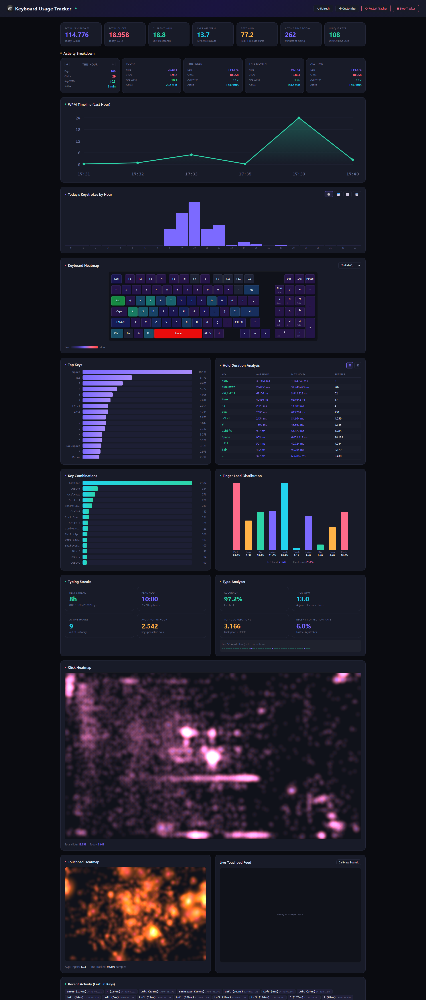

# Keyboard Usage Tracker

A zero latency, cross platform background keyboard, mouse, and touchpad usage tracker with a real time web dashboard.

Runs silently in the background, logs every keystroke, mouse click, and touchpad interaction to a local SQLite database, and serves a live statistics dashboard at `http://127.0.0.1:9898`.

## Screenshot

## Features

- **Cross Platform**: Supports Windows (via low-level hooks) and Linux (via `evdev`).
- **Low-level Input Capturing**: Highly optimized, zero latency systemwide capturing of keyboard and mouse events.
- **Touchpad Tracking**: Tracks touchpad gestures, finger count, and even provides a live touchpad visualization (via WebSocket at `127.0.0.1:9899`).
- **Comprehensive Analytics plugins**:
  - **Typing Streaks**: Analyzes your longest periods of sustained typing.
  - **Typo Analyzer**: Detects backspace usage to calculate your true accuracy.
  - **Finger Load**: Estimates the workload on each finger based on standard touchtyping rules.
  - **Key Combos**: Tracks frequency of keyboard shortcuts.
  - **Heatmaps**: Visual representations for keyboard, clicks, and touchpad interactions.
  - **Hold Duration**: Measures exactly how long each key is held down.
- **Realtime WPM**: Calculates current, average, and best words per minute.
- **Web Dashboard**: Beautiful dark themed dashboard with deep analytics across hourly, daily, weekly, monthly, and alltime periods.
- **System Tray (Windows)**: Minimal footprint with right click menu for quick access to the dashboard, restart, and exit.
- **Single Instance**: Prevents multiple copies from running and corrupting the database.
- **Secure & Private**: Data is stored completely locally. Hardwarebound rotating token authentication protects the dashboard APIs against unauthorized access.

## Requirements

- **Windows**: Windows 10 or later.
- **Linux**: Permissions to read `/dev/input/` events (typically adding your user to the `input` group).
- [Rust toolchain](https://rustup.rs/) (to build from source).

## Building

`shell
cargo build --release
`

The compiled binary will be located at `target/release/keyboard-usage-tracker` (or `.exe` on Windows).

## Usage

Simply run the compiled executable. On Windows, it will automatically hide in the system tray. On Linux, it runs as a background process or terminal app depending on how you launch it.

1. Starts tracking keyboard, mouse, and touchpad input in the background.
2. Automatically opens the dashboard in your default browser (or right click the tray icon).
3. Serves the dashboard at [http://127.0.0.1:9898](http://127.0.0.1:9898).
4. Serves live touchpad WebSocket at `ws://127.0.0.1:9899`.

### Database Locations

Data is stored locally in an SQLite database `tracker.db`:
- **Windows**: `%LOCALAPPDATA%\keyboard-usage-tracker\tracker.db`
- **Linux**: `$XDG_DATA_HOME/keyboard-usage-tracker/tracker.db` (or `~/.local/share/...`)

## Dashboard Plugins

The dashboard is built with a modular plugin architecture located in `plugins/`, which currently includes:

- `activity-breakdown.js` / `activity-charts.js`
- `stats-cards.js` / `recent-activity.js`
- `top-keys.js` / `key-combos.js`
- `keyboard-heatmap.js` / `click-heatmap.js` / `touchpad-heatmap.js`
- `live-touchpad.js` (uses WebSocket for realtime contact rendering)
- `typing-streaks.js` / `wpm-timeline.js` / `typo-analyzer.js`
- `finger-load.js` / `hold-duration.js`

## Privacy & Security

This application is fundamentally a **system wide input logger**. Please be aware of the following:

- **All data stays local.** Nothing is transmitted over the network. The HTTP server binds exclusively to `127.0.0.1` and is completely inaccessible from other machines on your network.
- **Inputs are stored in plaintext** in the local SQLite database. This includes every key you press while the tracker is running.
- **Protect your database file.** Because it contains raw keystroke data, treat it like a highly sensitive file. Do not share it or leave it in a publicly accessible location.
- **API endpoints are token protected.** The dashboard uses hardwarebound rotating tokens so that only your local browser session can query data via the REST API or connect to the WebSockets.
- **You are responsible for your own data.** This tool is strictly intended for personal productivity analysis. Do not run it on machines where other users may be affected without their explicit consent.

## License

This project is licensed under the [GNU General Public License v3.0](https://www.gnu.org/licenses/gpl-3.0.html).
