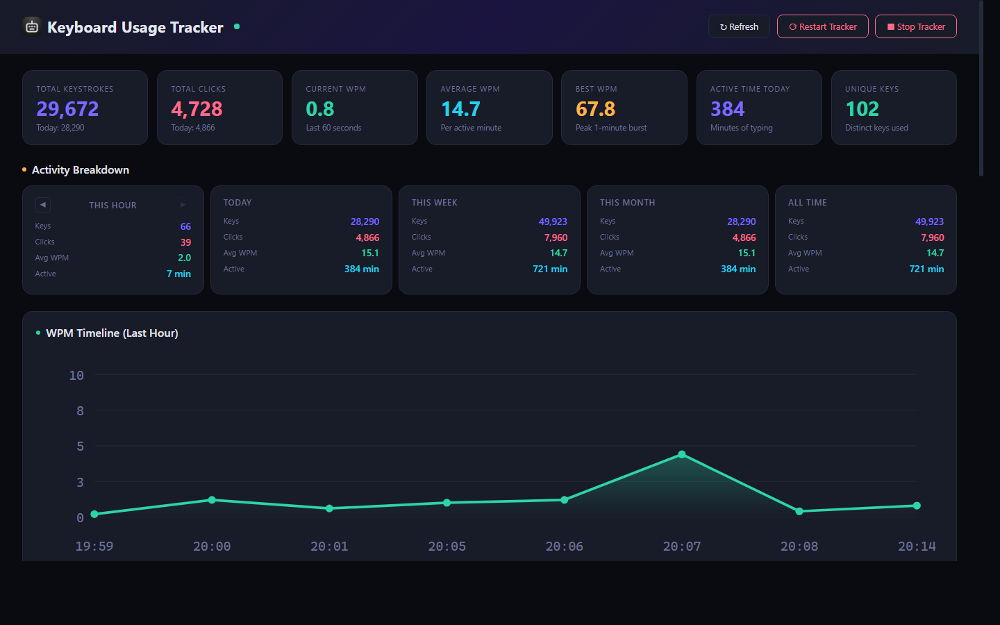
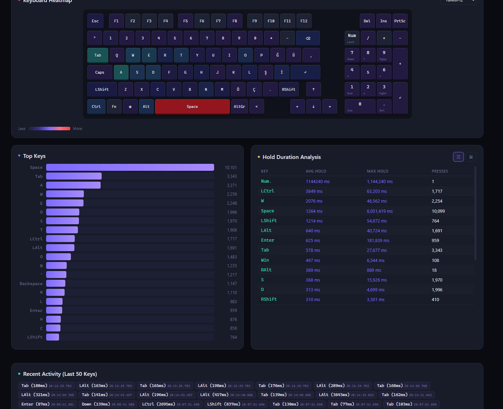

# Keyboard Usage Tracker

A zero latency background keyboard and mouse usage tracker for Windows with a realtime web dashboard.

Runs silently in the system tray, logs every keystroke and mouse click to a local SQLite database, and serves a live statistics dashboard at `http://127.0.0.1:9898`.

## Screenshots





## Features

- **Low-level input hooks**: captures all keyboard and mouse events system-wide via `WH_KEYBOARD_LL` / `WH_MOUSE_LL`
- **Hold duration tracking**: measures how long each key is held down
- **Realtime WPM**: calculates current, average, and best words-per-minute
- **Web dashboard**: beautiful dark themed dashboard with charts for hourly, daily, weekly, and monthly activity
- **Period comparison**: stats breakdown by hour, day, week, month, and all-time
- **System tray**: minimal footprint with right click menu for dashboard, restart, and exit
- **Single instance**: prevents multiple copies from running and corrupting the database
- **Local only**: dashboard binds to `127.0.0.1`, data never leaves your machine
- **Token authenticated API**: rotating hardware-bound tokens protect dashboard endpoints

## Requirements

- Windows 10 or later
- [Rust toolchain](https://rustup.rs/) (to build from source)

## Building

```
cargo build --release
```

The compiled binary will be at `target/release/keyboard-usage-tracker.exe`.

## Usage

Run the executable. It will:

1. Start tracking keyboard and mouse input in the background
2. Open the dashboard in your default browser automatically
3. Appear as a tray icon — right-click for options

The dashboard is available at [http://127.0.0.1:9898](http://127.0.0.1:9898).

Data is stored in `%LOCALAPPDATA%\keyboard-usage-tracker\tracker.db`.

## Dashboard

The web dashboard shows:

- Total keystrokes and clicks (today / all-time)
- Current, average, and best WPM
- Active minutes today
- Top keys heatmap
- Key hold duration stats
- Hourly / daily / weekly / monthly activity charts
- Real-time WPM timeline
- Recent keystrokes feed

## Privacy & Security

This application is a **keystroke and mouse click logger**. Please be aware of the following:

- **All data stays local.** Nothing is transmitted over the network. The dashboard binds exclusively to `127.0.0.1` and is not accessible from other machines.
- **Keystrokes are stored in plaintext** in a local SQLite database at `%LOCALAPPDATA%\keyboard-usage-tracker\tracker.db`. This includes every key you press while the tracker is running.
- **Protect your database file.** Because it contains raw keystroke data, treat it like a sensitive file. Do not share it or leave it in a publicly accessible location.
- **API endpoints are token protected.** The dashboard uses hardware bound rotating tokens so that only your local browser session can access the data.
- **You are responsible for your own data.** This tool is intended for personal productivity analysis. Do not run it on machines where other users may be affected without their consent.

## License

This project is licensed under the [GNU General Public License v3.0](https://www.gnu.org/licenses/gpl-3.0.html).
